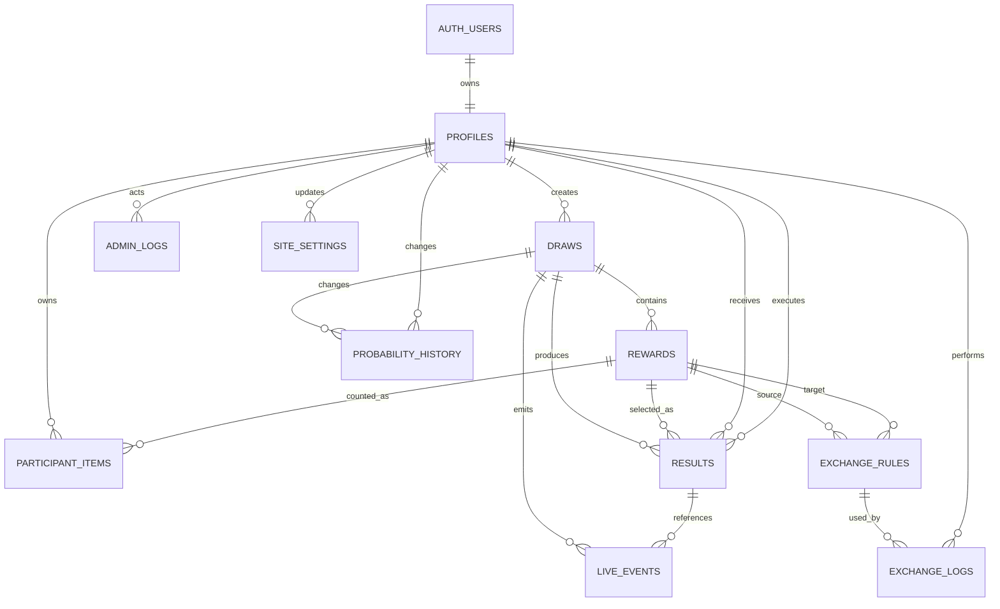

# Dynamic Draw DB·API·보안 기술 문서

문서 버전: 1.2  
기준일: 2026-06-24  
구현 위치: Next.js App Router + Supabase PostgreSQL + Supabase Auth/Realtime + Vercel

---

# 1. 시스템 개요

## 1.1 목표

Dynamic Draw는 결제 없이 행사 추첨을 운영하는 서비스다. 핵심 원칙은 다음과 같다.

1. 결과는 브라우저가 아니라 PostgreSQL 트랜잭션 안에서 결정한다.
2. 화면의 카드 애니메이션은 이미 결정된 결과를 늦게 보여 주는 연출이다.
3. 상품 확률 합계가 정확히 100%일 때만 진행 상태로 전환한다.
4. 확률 변경 기록과 관리자 감사 기록은 수정·삭제할 수 없게 한다.
5. 회원 가입은 신청형이며 관리자가 승인하면서 고유 회원 ID를 발급한다.
6. 상품 교환은 회원 본인의 보유 수량을 잠근 뒤 원자적으로 차감·지급한다.

## 1.2 아키텍처

```text
[일반 사용자 브라우저] ─┐
                        ├─ HTTPS ─ [Vercel / Next.js 16]
[관리자 브라우저] ──────┘                  │
                                            ├─ Supabase Auth
                                            ├─ PostgreSQL + RPC
                                            └─ Supabase Realtime WebSocket

공개 조회: 브라우저 또는 Next.js 서버 → RLS가 적용된 공개 데이터
관리 변경: 브라우저 → Next.js Route Handler → 권한·CSRF·입력 검증 → Secret key 서버 클라이언트 → DB
추첨·교환: Next.js Route Handler → PostgreSQL SECURITY DEFINER 함수 → 하나의 트랜잭션
실시간: DB live_events INSERT → Supabase Realtime → 공개 브라우저
```

## 1.3 기술 스택

| 구분 | 선택 | 사용 이유 |
|---|---|---|
| 프론트엔드 | Next.js 16 App Router, React 19, TypeScript | 화면과 API를 한 저장소에서 관리 |
| UI | 자체 CSS, Lucide, Motion | 의존성을 줄이고 카드 연출 구현 |
| 차트 | Recharts | 통계 차트 구현이 단순함 |
| 검증 | Zod | API 입력값 런타임 검증 |
| 인증 | Supabase Auth | 이메일·비밀번호, JWT, Refresh Session |
| 데이터베이스 | Supabase PostgreSQL | 관계형 제약, 트랜잭션, RLS, RPC |
| 실시간 | Supabase Realtime Postgres Changes | 별도 WebSocket 서버 없이 DB 이벤트 전송 |
| 호스팅 | Vercel | Next.js 자동 빌드·HTTPS·커스텀 도메인 |

---

# 2. 권한 모델

| 역할 | 설명 | 주요 권한 |
|---|---|---|
| USER | 승인된 일반 회원 | 본인 보유 상품·결과·교환 조회, 교환 실행 |
| VIEWER | 읽기 전용 운영자 | 관리자 대시보드, 결과·통계·감사 기록 조회 |
| MANAGER | 일반 관리자 | VIEWER + 회원 승인, 뽑기·상품·확률·교환 규칙 관리, 추첨 실행 |
| SUPER_ADMIN | 최고 관리자 | MANAGER + 결과 무효 처리, 전역 설정, 회원 역할 변경 |

회원 상태는 역할과 별도로 관리한다.

| 상태 | 의미 |
|---|---|
| PENDING | 가입 신청 후 승인 전 |
| APPROVED | 로그인 후 기능 사용 가능 |
| REJECTED | 가입 반려 |
| SUSPENDED | 기존 회원 이용 정지 |

관리 API는 역할과 승인 상태를 모두 검사한다. 역할이 관리자여도 `APPROVED`가 아니면 허용하지 않는다.

---

# 3. 페이지·UI 구조

## 3.1 공개 페이지

| URL | 화면 | 주요 기능 |
|---|---|---|
| `/` | 메인 | 서비스 소개, 지표, 상품, 실시간 연출, 최근 결과 |
| `/draws` | 진행 중인 뽑기 | 공개 뽑기와 상품 확인 |
| `/probabilities` | 확률표 | 상품별 설정 확률, 합계 100% 확인 |
| `/live` | 실시간 결과 | 흔들림 → 빛 → 뒤집기 → 결과 공개 |
| `/results` | 최근 당첨 | 가려진 이름·고유 ID와 결과 목록 |
| `/stats` | 공개 통계 | 총 추첨, 상품별 실제 출현율, 일별 차트 |

## 3.2 회원 페이지

| URL | 화면 | 주요 기능 |
|---|---|---|
| `/signup` | 가입 신청 | 이름, 연락처, 이메일, 비밀번호 |
| `/setup-admin` | 최초 관리자 설치 | 설치 비밀문자로 첫 SUPER_ADMIN 1회 생성 |
| `/login` | 로그인 | 이메일·비밀번호 로그인 |
| `/forgot-password` | 비밀번호 복구 요청 | 가입 이메일로 복구 링크 요청 |
| `/reset-password` | 새 비밀번호 저장 | 복구 세션 확인 후 비밀번호 변경 |
| `/auth/confirm` | 이메일 인증 콜백 | PKCE code 또는 token hash를 세션으로 교환 |
| `/pending` | 승인 대기 | 현재 가입 상태 안내 |
| `/account` | 내 정보 | 고유 ID, 보유 상품, 개인 결과·교환 기록 |
| `/exchange` | 교환 | 가능한 교환 규칙과 보유 수량, 교환 실행 |

## 3.3 관리자 페이지

| URL | 화면 | 주요 기능 |
|---|---|---|
| `/admin` | 대시보드 | 주요 지표, 최근 결과, 최근 관리자 행동 |
| `/admin/draws` | 뽑기·상품·확률 | 생성, 수정, 상태, 상품, 재고, 확률 100% 저장 |
| `/admin/live` | 실시간 추첨 | 뽑기·회원 선택, 추첨 실행 |
| `/admin/members` | 회원 관리 | 검색·상태 필터, 승인, 고유 ID 자동 발급, 반려, 정지, 복구, 역할 변경 |
| `/admin/exchanges` | 교환 시스템 | 고유 ID 관리자 현장 교환, 규칙 생성·수정·비활성화 |
| `/admin/results` | 결과 관리 | 결과 공개 상태 확인, 사유 기반 무효 처리 |
| `/admin/stats` | 관리자 통계 | 전체 지표와 차트 |
| `/admin/probability-history` | 확률 변경 기록 | 뽑기·관리자·기간 필터, 변경 전후·사유·IP·해시 조회 |
| `/admin/logs` | 관리자 로그 | 행동, 대상, 상세 JSON, 해시 체인 조회 |
| `/admin/settings` | 설정 | 사이트 이름·메인 문구·통계 공개 설정 |

## 3.4 반응형 원칙

- 데스크톱: 공개 상단 메뉴, 관리자 좌측 사이드바, 다열 카드
- 태블릿: 카드 열 축소, 표 가로 스크롤
- 모바일: 공개 햄버거 메뉴, 관리자 메뉴 가로 스크롤, 입력 폼 한 열
- 최소 권장 너비: 390px
- 표 안의 중요 버튼은 모바일에서도 최소 터치 영역을 확보

---

# 4. 데이터베이스 설계

PostgreSQL 스키마는 `supabase/migrations/202606240001_initial_schema.sql`에 있다. 실제 설치용 합본은 `supabase/PASTE_THIS_ONCE.sql`이다.

## 4.1 ENUM

| 타입 | 값 |
|---|---|
| `profile_status` | PENDING, APPROVED, REJECTED, SUSPENDED |
| `user_role` | USER, VIEWER, MANAGER, SUPER_ADMIN |
| `draw_status` | DRAFT, ACTIVE, PAUSED, ENDED |
| `live_event_type` | DRAW_START, DRAW_ANIMATING, DRAW_RESULT, STATS_UPDATE |

## 4.2 `profiles`

목적: Supabase `auth.users`와 1:1인 서비스 회원·관리자 프로필.

| 컬럼 | 타입 | Null | 기본값·제약 |
|---|---|---|---|
| id | uuid | N | PK, `auth.users(id)` FK, 계정 삭제 시 cascade |
| email | text | N | 소문자 유니크 인덱스 |
| display_name | text | N | 2~30자 |
| phone | text | Y | 선택 입력 |
| role | user_role | N | USER |
| status | profile_status | N | PENDING |
| member_code | text | Y | UNIQUE, 승인 시 `DD-YYYY-...` |
| approved_by | uuid | Y | profiles FK |
| approved_at | timestamptz | Y | 승인 시각 |
| rejection_reason | text | Y | 반려·정지 사유 |
| last_login_at | timestamptz | Y | 마지막 로그인 |
| created_at | timestamptz | N | now() |
| updated_at | timestamptz | N | now(), trigger 자동 갱신 |

트리거 `handle_new_auth_user`가 Auth 가입 시 `PENDING` 프로필을 자동 생성한다. `member_code_seq`와 `next_member_code()`가 승인 시 중복되지 않는 `DD-YYYY-6자리` 고유 ID를 서버에서 발급한다.

## 4.3 `draws`

목적: 뽑기 이벤트 정의.

| 컬럼 | 타입 | Null | 기본값·제약 |
|---|---|---|---|
| id | uuid | N | PK, gen_random_uuid() |
| name | text | N | 2~80자 |
| slug | text | N | UNIQUE |
| description | text | Y | 설명 |
| status | draw_status | N | DRAFT |
| animation_ms | integer | N | 4000, 3000~5000 |
| is_public | boolean | N | true |
| created_by | uuid | Y | profiles FK |
| created_at | timestamptz | N | now() |
| updated_at | timestamptz | N | now() |

`ACTIVE` 전환 전에 `validate_draw_ready`가 활성 상품, 확률 합계 1,000,000, 유한 재고를 검증한다.

## 4.4 `rewards`

목적: 뽑기 상품과 확률, 재고, 교환 속성.

| 컬럼 | 타입 | Null | 기본값·제약 |
|---|---|---|---|
| id | uuid | N | PK |
| draw_id | uuid | N | draws FK, 삭제 제한 |
| name | text | N | 1~80자, 뽑기 안에서 UNIQUE |
| description | text | Y | 설명 |
| image_url | text | Y | 향후 이미지 기능용 |
| color | text | N | `#RRGGBB` |
| probability_units | integer | N | 0~1,000,000 |
| stock | integer | Y | null=무제한, 0 이상 |
| is_inventory_item | boolean | N | 당첨 시 회원 보유함 적립 여부 |
| is_exchange_material | boolean | N | 교환 재료 표시 여부 |
| is_active | boolean | N | 활성 여부 |
| sort_order | integer | N | 정렬 순서 |
| created_at | timestamptz | N | now() |
| updated_at | timestamptz | N | now() |

확률 100%를 정수 `1,000,000`으로 저장한다. 예: 40%=400,000, 0.0001%=1.

## 4.5 `participant_items`

목적: 회원별 상품 보유 수량.

| 컬럼 | 타입 | Null | 제약 |
|---|---|---|---|
| profile_id | uuid | N | profiles FK |
| reward_id | uuid | N | rewards FK |
| quantity | integer | N | 0 이상 |
| created_at | timestamptz | N | now() |
| updated_at | timestamptz | N | now() |

복합 PK: `(profile_id, reward_id)`.

## 4.6 `results`

목적: 서버에서 확정한 개별 추첨 결과와 당시 확률 스냅샷.

| 컬럼 | 타입 | Null | 기본값·제약 |
|---|---|---|---|
| id | uuid | N | PK |
| draw_id | uuid | N | draws FK |
| reward_id | uuid | N | rewards FK |
| participant_id | uuid | N | profiles FK |
| executed_by | uuid | N | 실행 관리자 profiles FK |
| idempotency_key | uuid | N | UNIQUE, 중복 실행 방지 |
| random_value | integer | N | 0~999,999 |
| probability_snapshot | jsonb | N | 실행 당시 전체 상품 확률 |
| public_display_name | text | N | 결과 당시 이름 스냅샷 |
| public_member_code | text | N | 결과 당시 고유 ID 스냅샷 |
| reveal_at | timestamptz | N | 공개 예정 시각 |
| revealed_at | timestamptz | Y | 실제 공개 시각 |
| voided_at | timestamptz | Y | 무효 시각 |
| voided_by | uuid | Y | 최고 관리자 FK |
| void_reason | text | Y | 무효 시 필수 |
| created_at | timestamptz | N | now() |

완전 삭제 대신 무효 처리한다. 공개 뷰와 통계는 `voided_at is null`인 공개 완료 결과만 사용한다.

## 4.7 `exchange_rules`

목적: 어떤 보유 상품도 다른 상품으로 교환할 수 있는 규칙.

| 컬럼 | 타입 | Null | 제약 |
|---|---|---|---|
| id | uuid | N | PK |
| name | text | N | 2~80자 |
| source_reward_id | uuid | N | 차감 상품 FK |
| source_quantity | integer | N | 1 이상 |
| target_reward_id | uuid | N | 지급 상품 FK |
| target_quantity | integer | N | 1 이상 |
| is_active | boolean | N | true |
| sort_order | integer | N | 정렬 |
| created_by | uuid | Y | 관리자 FK |
| created_at | timestamptz | N | now() |
| updated_at | timestamptz | N | now() |

차감 상품과 지급 상품은 같을 수 없다.

## 4.8 `exchange_logs`

목적: 회원 교환의 불변 결과 기록.

| 컬럼 | 타입 | Null | 제약 |
|---|---|---|---|
| id | uuid | N | PK |
| rule_id | uuid | N | exchange_rules FK |
| profile_id | uuid | N | 회원 FK |
| source_reward_id | uuid | N | 차감 상품 FK |
| source_quantity | integer | N | 실제 차감량 |
| target_reward_id | uuid | N | 지급 상품 FK |
| target_quantity | integer | N | 실제 지급량 |
| idempotency_key | uuid | N | UNIQUE |
| ip_address | text | N | 요청 IP |
| user_agent | text | N | 요청 브라우저 |
| created_at | timestamptz | N | now() |

## 4.9 `probability_history`

목적: 확률 변경 전후와 사유의 삭제 불가능한 기록.

| 컬럼 | 타입 | Null | 제약 |
|---|---|---|---|
| id | uuid | N | PK |
| sequence_no | bigint | N | identity, UNIQUE |
| draw_id | uuid | N | draws FK |
| admin_id | uuid | N | profiles FK |
| before_values | jsonb | N | 변경 전 배열 |
| after_values | jsonb | N | 변경 후 배열 |
| reason | text | N | 2~200자 |
| ip_address | text | N | 요청 IP |
| user_agent | text | N | 요청 브라우저 |
| previous_hash | text | Y | 직전 기록 해시 |
| entry_hash | text | N | 현재 기록 SHA-256 |
| created_at | timestamptz | N | now() |

UPDATE와 DELETE는 `block_audit_mutation` 트리거가 거부한다.

## 4.10 `admin_logs`

목적: 관리자 로그인과 모든 중요 변경의 감사 기록.

| 컬럼 | 타입 | Null | 제약 |
|---|---|---|---|
| id | uuid | N | PK |
| sequence_no | bigint | N | identity, UNIQUE |
| admin_id | uuid | Y | 관리자 FK, 삭제 시 null |
| action | text | N | 행동 코드 |
| target_table | text | Y | 대상 테이블 |
| target_id | uuid | Y | 대상 ID |
| details | jsonb | N | 상세 데이터 |
| ip_address | text | N | 요청 IP |
| user_agent | text | N | 브라우저 |
| previous_hash | text | Y | 직전 해시 |
| entry_hash | text | N | 현재 기록 SHA-256 |
| created_at | timestamptz | N | now() |

UPDATE와 DELETE를 차단하고, 삽입은 서버 전용 RPC로 수행한다.

## 4.11 `live_events`

목적: 실시간 공개 클라이언트가 구독하는 이벤트 큐.

| 컬럼 | 타입 | Null | 제약 |
|---|---|---|---|
| id | uuid | N | PK |
| draw_id | uuid | N | draws FK |
| result_id | uuid | Y | results FK |
| event_type | live_event_type | N | 이벤트 타입 |
| payload | jsonb | N | 공개 가능한 데이터만 포함 |
| created_at | timestamptz | N | now() |

공개 RLS는 공개 뽑기의 최근 24시간 이벤트만 읽게 하고, 로그인 회원·관리자는 업무에 필요한 개인/관리 이벤트 범위를 별도로 허용한다.

## 4.12 `site_settings`

목적: 코드 수정 없이 변경하는 공개 사이트 문구.

| 컬럼 | 타입 | Null | 제약 |
|---|---|---|---|
| key | text | N | PK |
| value | jsonb | N | 값 |
| is_public | boolean | N | 공개 조회 여부 |
| updated_by | uuid | Y | 관리자 FK |
| updated_at | timestamptz | N | now() |

기본 키: `site_name`, `hero_title`, `hero_description`, `public_stats`.

## 4.13 `rate_limits`

목적: 서버리스 인스턴스 사이에서도 공유되는 요청 제한 카운터.

| 컬럼 | 타입 | Null | 제약 |
|---|---|---|---|
| key | text | N | PK |
| window_start | timestamptz | N | 현재 구간 시작 |
| request_count | integer | N | 0 이상 |
| updated_at | timestamptz | N | now() |

브라우저에서는 접근할 수 없고 서버 전용 RPC만 사용한다.

## 4.14 공개 뷰 `public_results`

개인 식별용 UUID를 null로 바꾸고, 이름과 고유 ID를 DB 함수로 마스킹한 뒤 공개 완료·정상 결과만 반환한다.

---

# 5. ERD



텍스트 관계:

```text
auth.users 1 ─ 1 profiles
profiles 1 ─ N draws
profiles 1 ─ N participant_items
profiles 1 ─ N results (participant_id)
profiles 1 ─ N results (executed_by)
draws 1 ─ N rewards
draws 1 ─ N results
draws 1 ─ N probability_history
draws 1 ─ N live_events
rewards 1 ─ N participant_items
rewards 1 ─ N results
rewards 1 ─ N exchange_rules (source)
rewards 1 ─ N exchange_rules (target)
exchange_rules 1 ─ N exchange_logs
profiles 1 ─ N exchange_logs
profiles 1 ─ N probability_history
profiles 1 ─ N admin_logs
results 1 ─ N live_events
```

---

# 6. 핵심 DB 함수

## 6.1 `validate_draw_ready(draw_id)`

- 활성 상품이 하나 이상인지 확인
- 활성 상품 확률 합계가 정확히 1,000,000인지 확인
- 확률이 0보다 큰 유한 재고 상품이 품절인지 확인
- 모두 통과하면 true 반환

## 6.2 `admin_update_probabilities(...)`

하나의 트랜잭션에서:

1. 현재 확률을 잠금 조회
2. 전달된 상품 목록이 정확한지 확인
3. 합계 100% 확인
4. 변경 전 JSON 생성
5. 상품 확률 갱신
6. 변경 후 JSON 생성
7. 직전 `entry_hash`를 가져옴
8. 이전 해시를 포함한 새 SHA-256 해시 생성
9. `probability_history` 삽입
10. `admin_logs` 삽입

## 6.3 `execute_draw(...)`

하나의 트랜잭션에서:

1. 같은 `idempotency_key` 결과가 있는지 확인
2. 뽑기별 advisory lock과 진행 중인 뽑기 행 잠금
3. 같은 뽑기에 미공개 정상 결과가 없는지 확인
4. 승인된 `USER` 회원과 고유 ID 확인
5. 상품·확률 합계·유한 재고 준비 상태 확인
6. `pgcrypto.gen_random_bytes`로 32비트 보안 난수 생성
7. rejection sampling으로 modulo bias를 제거한 0~999,999 값 생성
8. 확률이 0보다 큰 상품만 누적 확률 구간에서 선택
9. 결과와 당시 전체 확률 스냅샷 저장
10. 선택 상품의 유한 재고 차감
11. 상품명을 포함하지 않은 `DRAW_START`, `DRAW_ANIMATING` 이벤트 저장
12. 관리자 감사 로그 저장

응답에는 결과 식별자와 공개 예정 시각만 포함한다. 결과 확정 시점에는 회원 보유함을 아직 늘리지 않고 상품 정보도 공개 이벤트에 넣지 않는다.

## 6.4 `reveal_result(...)` / `reveal_due_results()`

- 결과 행을 잠그고 무효·중복 공개 여부 확인
- 공개 예정 시각이 지난 첫 공개에서만 `revealed_at` 설정
- 보관 상품이면 같은 트랜잭션에서 `participant_items`를 정확히 한 번 +1
- 이름과 고유 ID를 DB 함수로 마스킹한 공개 payload 생성
- `DRAW_RESULT`, `STATS_UPDATE` 이벤트 저장
- 이미 공개된 결과 재호출은 추가 적립 없이 기존 공개 payload만 반환
- 관리자가 탭을 닫아도 공개 페이지의 복구 호출이 지연 결과를 공개

## 6.5 `exchange_items(...)`

- 같은 멱등 키면 기존 결과 반환
- 회원·규칙·상품·보유 수량을 행 잠금
- 재료 수량 부족 시 전체 취소
- 재료 차감, 대상 지급, 유한 재고 차감
- `exchange_logs` 저장
- 하나라도 실패하면 모두 롤백

## 6.6 `void_result(...)`

- SUPER_ADMIN 전용 API를 통해 호출
- 공개 완료·정상 결과와 사유를 확인
- 보관 상품이면 회원 보유 상품을 회수할 수 있을 때만 처리
- 유한 재고 복구
- 공개 결과와 통계에서 제외
- 감사 로그 저장
- 원 결과 행 자체는 보존

## 6.7 감사 해시 재검증

- `verify_admin_log_chain()`은 순번대로 이전 해시와 현재 행을 다시 결합해 SHA-256을 계산한다.
- `verify_probability_history_chain()`은 확률 변경 행도 같은 방식으로 재계산한다.
- 두 함수는 서버 전용 `service_role`만 호출할 수 있다.
- 관리자 로그·확률 변경 화면은 검증한 행 수와 최초 이상 순번을 표시한다.

---

# 7. REST API 설계

## 7.1 공통 응답

성공:

```json
{
  "ok": true,
  "data": {}
}
```

실패:

```json
{
  "ok": false,
  "error": {
    "code": "VALIDATION_ERROR",
    "message": "입력값을 확인해 주세요.",
    "details": null
  }
}
```

공통 상태 코드:

| 코드 | 의미 |
|---|---|
| 200 | 조회·수정 성공 |
| 201 | 생성·추첨·교환 성공 |
| 400 | 업무 규칙 또는 DB 처리 실패 |
| 401 | 로그인 필요 |
| 403 | 승인·역할 부족 또는 다른 출처 요청 |
| 404 | 대상 없음 |
| 409 | 중복·재고·상태 충돌 |
| 422 | 입력값 검증 실패 |
| 429 | 요청 횟수 제한 |
| 503 | Supabase 미연결·Secret key 누락 또는 요청 제한 상태 확인 실패 |

## 7.2 인증 API

### `POST /api/setup-admin`

인증: 일반 로그인 세션 불필요. `ADMIN_SETUP_SECRET` 필요  
제한: IP 기준 15분 5회, 기존 SUPER_ADMIN이 한 명이라도 있으면 영구 차단

```json
{
  "setupSecret": "Vercel에 설정한 32자 이상 비밀문자",
  "displayName": "Dynamic 관리자",
  "email": "admin@example.com",
  "password": "10자 이상 비밀번호"
}
```

Supabase Auth 계정을 이메일 확인 완료 상태로 생성하고, `profiles`를 `APPROVED / SUPER_ADMIN`으로 전환하며 고유 ID를 자동 발급한다. 최초 생성 뒤 같은 엔드포인트는 409를 반환한다.

### `POST /api/auth/signup`

인증: 없음  
제한: IP 기준 10분 5회

요청:

```json
{
  "displayName": "홍길동",
  "phone": "010-1234-5678",
  "email": "user@example.com",
  "password": "8자이상비밀번호"
}
```

처리: Supabase Auth 가입, 이메일 확인 URL `/auth/confirm`, profiles 자동 PENDING 생성.

응답:

```json
{
  "ok": true,
  "data": {
    "userId": "uuid",
    "redirectTo": "/login",
    "message": "가입 신청이 완료되었습니다. 이메일 인증 후 로그인해 주세요."
  }
}
```

### `POST /api/auth/login`

인증: 없음  
제한: IP 기준 10분 10회

요청:

```json
{
  "email": "user@example.com",
  "password": "비밀번호",
  "nextPath": "/account"
}
```

승인 상태와 역할에 따라 `/pending`, `/account`, `/admin`으로 이동한다. 반려·정지 계정은 세션을 즉시 종료한다.

### `POST /api/auth/logout`

인증: 선택. 관리자면 로그아웃 행동을 감사 로그에 저장한다.

### `POST /api/auth/forgot-password`

인증: 없음  
제한: IP 기준 15분 5회

```json
{
  "email": "user@example.com"
}
```

계정 존재 여부를 외부에 자세히 노출하지 않는 동일한 안내 응답을 반환하고, Supabase 복구 링크의 이동 주소를 `/reset-password`로 지정한다.

### `POST /api/auth/reset-password`

인증: 복구 링크로 생성된 유효 세션 필요  
제한: 계정 기준 15분 5회

```json
{
  "password": "새로운8자이상비밀번호"
}
```

현재 Auth 사용자의 비밀번호를 변경한다. 서비스 역할·승인 상태·고유 ID는 변경하지 않는다.

## 7.3 회원 관리 API

### `POST /api/admin/members/:id/:action`

권한: MANAGER 이상  
`action`: `approve`, `reject`, `suspend`, `restore`

승인 요청:

```json
{}
```

고유 ID는 DB의 `next_member_code()`가 자동 발급한다. 운영상 필요한 경우에만 검증된 `memberCode`를 선택적으로 전달할 수 있다.

반려·정지 요청:

```json
{
  "reason": "신청 정보를 확인할 수 없음"
}
```

중복 고유 ID는 409 `MEMBER_CODE_DUPLICATE`.

### `PATCH /api/admin/members/:id/role`

권한: SUPER_ADMIN

```json
{
  "role": "MANAGER"
}
```

승인된 회원만 관리자 역할로 변경할 수 있다. 현재 최고 관리자의 자기 권한 하향과 마지막 최고 관리자 제거는 409로 차단한다. 변경은 `MEMBER_ROLE_CHANGED` 로그에 남는다.

## 7.4 뽑기 API

### `POST /api/admin/draws`

권한: MANAGER 이상

```json
{
  "name": "입장권 뽑기",
  "description": "행사 추첨",
  "animationMs": 4000
}
```

생성 상태는 DRAFT다.

### `PATCH /api/admin/draws/:id`

권한: MANAGER 이상

```json
{
  "name": "여름 이벤트 뽑기",
  "status": "ACTIVE",
  "animationMs": 4500,
  "isPublic": true
}
```

ACTIVE 전환 시 확률·재고 준비 검사를 한다.

### `POST /api/admin/draws/:id/spin`

권한: MANAGER 이상  
제한: 관리자당 1분 12회

```json
{
  "participantId": "회원 UUID",
  "idempotencyKey": "요청마다 만든 UUID"
}
```

응답 예:

```json
{
  "ok": true,
  "data": {
    "resultId": "uuid",
    "revealAt": "2026-06-24T10:00:04.000Z",
    "animationMs": 4000,
    "duplicate": false
  }
}
```

## 7.5 상품 API

### `POST /api/admin/rewards`

권한: MANAGER 이상

```json
{
  "drawId": "uuid",
  "name": "찢어진 입장권",
  "description": "모아서 교환",
  "color": "#38bdf8",
  "stock": null,
  "isInventoryItem": true,
  "isExchangeMaterial": true
}
```

신규 상품 확률은 0%다.

### `PATCH /api/admin/rewards/:id`

권한: MANAGER 이상. 이름, 설명, 색상, 재고, 속성, 활성 여부 수정.

### `DELETE /api/admin/rewards/:id`

권한: MANAGER 이상. 실제 삭제가 아니라 비활성화. 현재 확률이 0%여야 하며 활성 교환 규칙 등 운영 참조 상태를 검사한다.

## 7.6 확률 API

### `PATCH /api/admin/draws/:id/probabilities`

권한: MANAGER 이상

```json
{
  "reason": "행사 2부 운영 비율 적용",
  "probabilities": [
    { "rewardId": "uuid-1", "percent": 55 },
    { "rewardId": "uuid-2", "percent": 40 },
    { "rewardId": "uuid-3", "percent": 4 },
    { "rewardId": "uuid-4", "percent": 1 }
  ]
}
```

서버와 DB가 각각 합계 100%를 검증한다.

## 7.7 결과 API

### `POST /api/admin/results/:id/reveal`

권한: MANAGER 이상. 운영자가 필요할 때 공개 가능 상태를 확인해 공개한다.

### `POST /api/admin/results/:id/void`

권한: SUPER_ADMIN

```json
{
  "reason": "잘못된 참가자 선택으로 인한 운영 무효"
}
```

### `POST /api/live/reveal-due`

인증: 없음  
제한: IP 기준 1분 30회. 공개 예정 시각이 지난 미공개 결과를 복구한다.

## 7.8 교환 API

### `POST /api/exchanges`

권한: 승인 일반 회원

```json
{
  "ruleId": "uuid",
  "idempotencyKey": "uuid"
}
```

성공 예:

```json
{
  "ok": true,
  "data": {
    "exchangeLogId": "uuid",
    "sourceRewardName": "찢어진 입장권",
    "sourceQuantity": 5,
    "targetRewardName": "DwX",
    "targetQuantity": 1,
    "duplicate": false
  }
}
```

### `POST /api/admin/exchanges`

권한: MANAGER 이상  
제한: 관리자당 1분 20회

```json
{
  "memberCode": "DD-2026-001001",
  "ruleId": "uuid",
  "idempotencyKey": "uuid"
}
```

고유 ID로 승인 일반 회원을 찾고 `exchange_items` 트랜잭션을 실행한다. 성공 시 `ADMIN_EXCHANGE_EXECUTED` 감사 로그를 추가한다.

### `POST /api/admin/exchange-rules`

권한: MANAGER 이상

```json
{
  "name": "입장권 5개 → DwX",
  "sourceRewardId": "uuid",
  "sourceQuantity": 5,
  "targetRewardId": "uuid",
  "targetQuantity": 1
}
```

### `PATCH /api/admin/exchange-rules/:id`

이름, 수량, 활성 여부 수정.

### `DELETE /api/admin/exchange-rules/:id`

실제 삭제가 아니라 비활성화.

## 7.9 설정·상태 API

### `PATCH /api/admin/settings`

권한: SUPER_ADMIN

```json
{
  "siteName": "Dynamic Draw",
  "heroTitle": "결과는 짜릿하게, 운영은 투명하게.",
  "heroDescription": "실시간 이벤트 추첨 시스템",
  "publicStats": true
}
```

### `GET /api/health`

서비스 상태, production/preview 모드, Supabase 설정 여부와 서버 시각 반환.

---

# 8. 실시간 이벤트 설계

`live_events` 테이블 INSERT를 Supabase Realtime이 WebSocket으로 전달한다.

## 8.1 `DRAW_START`

발생: 결과를 DB에 저장한 직후.

```json
{
  "drawId": "uuid",
  "resultId": "uuid",
  "animationMs": 4000,
  "startedAt": "ISO-8601"
}
```

클라이언트: 기존 결과를 숨기고 카드 흔들림 시작.

## 8.2 `DRAW_ANIMATING`

발생: 시작 이벤트와 함께 저장. 시작 이벤트를 늦게 받은 클라이언트의 보조 신호.

```json
{
  "resultId": "uuid",
  "revealAt": "ISO-8601"
}
```

클라이언트: 현재 대기 상태라면 흔들림 연출 시작.

## 8.3 `DRAW_RESULT`

발생: `reveal_at` 도달 후 공개 함수 실행.

```json
{
  "resultId": "uuid",
  "rewardName": "Dynamic",
  "rewardColor": "#fbbf24",
  "participantName": "홍길동",
  "memberCode": "DD-2026-000001",
  "revealedAt": "ISO-8601"
}
```

클라이언트: 카드를 뒤집고 마스킹된 참가자 정보와 상품 표시.

## 8.4 `STATS_UPDATE`

발생: 결과 공개 또는 무효 처리.

```json
{
  "resultId": "uuid",
  "voided": false
}
```

공개 메인·최근 결과·통계 화면의 `RealtimeRefresh`가 이 이벤트를 받으면 짧은 debounce 뒤 서버 컴포넌트를 다시 읽어 최신 통계와 목록을 반영한다.

## 8.5 복구 전략

- 공개 페이지는 2.5초마다 `reveal-due`를 제한적으로 호출
- 공개 예정 시간이 지난 결과가 있으면 DB가 공개 처리
- 관리자 브라우저 종료, 네트워크 일시 끊김에도 결과가 영구 미공개 상태로 남지 않음
- 공개 이벤트는 공개 뽑기의 최근 24시간만 RLS 조회 허용
- 실시간 화면은 구독 시작 직후 가장 최근 이벤트를 조회해 진행 중 연출 또는 최근 결과를 복구

---

# 9. 애니메이션 설계

상태 머신:

```text
idle
  ↓ DRAW_START
shaking (0~1초)
  ↓
glowing (1~2.45초)
  ↓
flipping (2.45초~결과 수신)
  ↓ DRAW_RESULT
revealed
```

Motion 구현:

- shaking: x·rotate 배열 기반 반복 흔들림
- glowing: 광원 요소 opacity·scale 확대
- flipping: 3D `rotateY: 180deg`
- revealed: 상품 색상을 CSS custom property로 반영
- 카드 앞뒤 면에 `backface-visibility: hidden`

중요 원칙:

- 애니메이션 타이머가 상품을 선택하지 않는다.
- 브라우저에 결과를 미리 내려 숨겨 두지 않는다.
- DB가 공개 시점이 된 뒤 `DRAW_RESULT` 이벤트로 상품 정보를 보낸다.
- 중복 구독을 막기 위해 단계는 ref로 추적하고 채널은 한 번만 구독한다.
- 새로고침하면 최근 공개 결과를 서버 렌더링하고, 구독 시작 직후 가장 최근 `live_events`를 조회해 10초 이내 진행 중 연출 또는 최신 결과를 복구한다.

---

# 10. 보안 설계

## 10.1 인증과 세션

- Supabase Auth 이메일·비밀번호 인증과 복구 이메일 기반 비밀번호 재설정
- Access JWT와 Refresh Token은 Supabase SSR 쿠키 어댑터로 관리
- `proxy.ts`가 요청마다 서버에서 사용자 상태를 갱신
- 권한 판단에는 클라이언트가 보낸 역할을 사용하지 않고 DB 프로필과 Auth 사용자 ID 사용
- 이메일 확인은 `/auth/confirm`에서 PKCE code 또는 token hash를 서버 세션으로 교환

## 10.2 관리자 API 보호

- 모든 변경 API는 `requireApiAdmin` 또는 `requireApiUser` 수행
- 역할 서열 검사: USER < VIEWER < MANAGER < SUPER_ADMIN
- 서비스 secret key는 서버 코드에서만 읽음
- 브라우저 번들에는 `NEXT_PUBLIC_` 공개 키만 포함
- 미리보기 모드에서는 모든 변경 API를 503으로 차단

## 10.3 CSRF

- 상태를 바꾸는 API는 `Origin`/`Host`가 같은지 검사
- 세션 쿠키를 사용하더라도 다른 사이트가 요청을 보내면 403
- GET은 데이터를 변경하지 않음

## 10.4 XSS·콘텐츠 보안

- React 기본 이스케이프 사용
- `dangerouslySetInnerHTML` 미사용
- 입력값을 Zod와 DB 길이 제약으로 검증
- CSP, `X-Content-Type-Options`, `X-Frame-Options`, `Referrer-Policy`, `Permissions-Policy` 헤더 설정
- 외부 이미지와 Supabase 연결 범위만 허용

## 10.5 SQL Injection

- Supabase Query Builder와 매개변수화 RPC 사용
- 사용자 입력으로 SQL 문자열 조합하지 않음
- DB 함수 입력은 명시적 타입과 제약으로 검증

## 10.6 RLS

- 공개 사용자는 공개 상태의 뽑기·활성 상품·활성 교환 규칙·공개 뽑기의 최근 실시간 이벤트·마스킹 결과만 조회
- 로그인 회원은 본인 프로필을 조회하며, 승인 상태일 때만 보유함·개인 결과·교환 기록과 해당 상품·뽑기 정보를 조회
- 공개·관리자 통계 집계는 초안·비공개 뽑기를 제외하며, 공개 통계 OFF 설정은 일반 사용자 화면에만 적용
- 감사 기록과 rate limit 테이블은 anon/authenticated 권한 회수
- 관리자 변경은 Vercel 서버에서 secret key로 수행

## 10.7 요청 제한

PostgreSQL 공유 카운터를 사용한다.

| 기능 | 제한 |
|---|---|
| 가입 | IP당 10분 5회 |
| 로그인 | IP당 10분 10회 |
| 비밀번호 복구 메일 | IP당 15분 5회 |
| 새 비밀번호 저장 | 계정당 15분 5회 |
| 추첨 | 관리자당 1분 12회 |
| 교환 | 회원당 1분 10회 |
| 공개 복구 | IP당 1분 30회 |

## 10.8 로그 위변조 방지

- 확률 기록과 관리자 로그 UPDATE·DELETE 트리거 차단
- 각 행의 해시는 직전 행 해시를 포함
- 순서 번호 identity로 누락·순서 변경 확인 가능
- 서버 전용 검증 함수가 모든 행의 해시를 다시 계산하고 관리자 화면에 정상/이상 상태 표시
- IP·User-Agent·대상·상세 JSON 저장
- PostgreSQL 관리자급 계정 자체가 침해되면 절대적 불변성을 보장할 수 없으므로, 향후 외부 저장소 해시 앵커를 추가할 수 있음

## 10.9 추첨 공정성

- `pgcrypto` 난수 바이트 사용
- rejection sampling으로 32비트 값을 1,000,000에 나눌 때 생기는 modulo bias 제거
- 확률은 정수 단위로 누적 구간 계산
- 확률 0 상품은 선택 조회에서 명시적으로 제외
- 결과와 확률 스냅샷을 같은 트랜잭션에 저장
- 동일 뽑기의 미공개 결과가 있으면 다음 추첨 차단
- 결과 저장 전 준비 상태와 재고를 잠금·검사
- 클라이언트에서 난수·상품 ID를 보내지 않음
- 과거 결과는 확률 변경의 영향을 받지 않도록 snapshot 보관
- 보관 상품 적립은 첫 결과 공개 트랜잭션에서만 수행

## 10.10 비밀 관리

GitHub에 넣지 않는 값:

```text
SUPABASE_SECRET_KEY
service_role key
DB 비밀번호
개인 관리자 비밀번호
```

Vercel Environment Variables에서 Secret key를 Sensitive 값으로 관리하고, 노출 의심 시 Supabase에서 키를 회전한 뒤 Vercel 값을 바꾸고 재배포한다.

---

# 11. 통계 설계

내부 집계 함수 `calculate_stats()`가 유효 공개 결과를 계산한다. 공개 화면은 `get_public_stats()`를 호출하며 `public_stats=false`이면 빈 통계를 반환한다. 관리자 화면은 서버 전용 `get_admin_stats()`를 사용하므로 공개 설정과 관계없이 실제 운영 통계를 본다.

- 총 추첨 수
- 오늘 추첨 수: Asia/Seoul 기준
- 승인 일반 회원 수
- 상품별 당첨 횟수
- 상품별 실제 출현율(각 상품이 속한 뽑기의 유효 결과를 분모로 계산)
- 설정 확률과 실제 출현율 비교
- 최근 7일 일별 추첨 수

분모는 `revealed_at is not null and voided_at is null`인 결과만 사용한다.

대규모 트래픽에서의 확장안:

1. 통계 집계 테이블 또는 materialized view 도입
2. 결과 공개 시 증분 카운터 갱신
3. 일정 주기 재계산으로 정합성 보정
4. Realtime Broadcast로 클라이언트별 DB 조회 감소

---

# 12. 배포 구성

## 12.1 환경변수

```env
NEXT_PUBLIC_SUPABASE_URL=https://프로젝트.supabase.co
NEXT_PUBLIC_SUPABASE_PUBLISHABLE_KEY=sb_publishable_...
SUPABASE_SECRET_KEY=sb_secret_...
NEXT_PUBLIC_SITE_URL=https://dynamic2020.com
NEXT_PUBLIC_DEMO_MODE=false
```

레거시 프로젝트는 publishable 대신 anon, secret 대신 service_role 키 사용 가능.

## 12.2 빌드 명령

```bash
npm install
npm run typecheck
npm run lint
npm run build
```

Vercel은 Next.js를 자동 감지한다. `vercel.json`은 함수 실행 지역을 서울 인접 리전 `icn1`로 지정한다.

## 12.3 DB 설치

1. `supabase/PASTE_THIS_ONCE.sql` 한 번 실행
2. Vercel 환경변수 `ADMIN_SETUP_SECRET`을 32자 이상으로 설정
3. `https://배포주소/setup-admin`에서 최초 최고 관리자 생성
4. `/login`에서 관리자 로그인

`supabase/MAKE_FIRST_ADMIN.sql`은 `/setup-admin`을 사용할 수 없는 비상 복구 상황에서만 사용하는 예비 파일이다.

## 12.4 도메인

- Vercel 프로젝트의 Settings → Domains에 `dynamic2020.com`과 `www.dynamic2020.com` 추가
- Vercel이 보여 주는 A/CNAME 값을 가비아 DNS에 입력
- CNAME은 가비아에서 마지막 점 필요
- Supabase Auth Site URL과 Redirect URLs에도 도메인 등록

상세 절차는 `docs/04_아주쉬운_배포설명서.md` 참고.

---

# 13. 테스트 계획

## 13.1 자동 검증

- TypeScript strict typecheck
- ESLint
- Next.js production build
- API Zod 검증
- DB CHECK, UNIQUE, FK, RLS
- SQL 파일 PostgreSQL 파서 문법 검사
- 미연결 미리보기 모드 주요 URL HTTP smoke test

## 13.2 핵심 통합 시나리오

1. 회원 가입 → 이메일 확인 → PENDING 생성
2. 관리자 승인 → 고유 ID 발급 → 일반 로그인
3. 뽑기 생성 → 상품 추가 → 확률 합계 99% 저장 거부
4. 합계 100% 저장 → 변경 이력 생성
5. 뽑기 ACTIVE → 승인 회원 추첨
6. 결과 저장 → 상품 정보 없는 실시간 시작 → 3~5초 뒤 공개
7. 공개 전 보유량 변화 없음 → 첫 공개 뒤 보유 상품 +1 확인
8. 동일 추첨 멱등 키·공개 재요청 → 중복 결과 반환, 추가 적립 없음
9. 교환 수량 부족 → 전체 실패
10. 교환 성공 → 차감·지급·로그 한 번씩
11. 동일 교환 멱등 키 재요청 → 추가 차감 없음
12. 결과 무효 → 보유량 회수·재고 복구·통계 제외
13. 감사 기록 UPDATE/DELETE 시 DB 거부
14. 감사 해시 체인 재검증 정상, 임의 변조 시 최초 이상 순번 감지
15. 확률 0% 상품이 경계값에서도 선택되지 않음
16. 일반 회원이 관리자 URL/API 접근 시 403 또는 리다이렉트
17. 다른 출처에서 변경 API 호출 시 CSRF 403
18. 복구 메일 → 새 비밀번호 저장 → 기존 역할·승인 상태 유지

---

# 14. 개발 로드맵

## v1.1 — 현재 구현

- 승인형 회원가입, 이메일 인증 콜백, 비밀번호 재설정
- 고유 회원 ID
- 역할 기반 관리자와 SUPER_ADMIN 역할 변경 UI
- 뽑기·상품·재고·확률
- DB 트랜잭션 추첨
- 실시간 카드 연출
- 보유 상품과 교환
- 공개·관리자 통계
- 확률 변경·관리자 감사 로그와 해시 체인 재검증
- 실시간 통계·결과 새로고침과 중간 접속 복구
- 결과 무효 처리
- 반응형 UI와 Vercel/Supabase 배포 문서

## v1.2 — 운영 편의

- 회원 CSV 일괄 등록·다운로드
- 결과·교환 CSV 다운로드
- 상품 이미지 Supabase Storage 업로드
- 목록 검색·기간·상태 필터와 페이지네이션
- 승인·반려 이메일 알림

## v1.3 — 행사 기능

- QR로 회원 고유 ID 스캔
- 이벤트별 공개 URL과 QR 포스터
- 시즌과 캠페인 그룹
- Discord Webhook 알림
- 카카오 공유 링크
- 현장용 전체 화면 모드와 음향 효과
- 교환 승인형/자동형 선택

## v2 — 확장성과 외부 검증

- 조직·행사별 멀티테넌트
- WebAuthn/MFA 관리자 로그인
- 공개 검증용 draw seed commitment 방식
- 감사 해시를 외부 저장소에 주기적으로 앵커링
- Supabase Broadcast 기반 대규모 실시간 채널
- 별도 통계 집계·큐·관측 시스템
- 운영자 승인 워크플로와 이중 승인

---

# 15. 운영 주의사항

1. 이 시스템은 결제·도박·현금성 환급 기능을 포함하지 않는다.
2. 개인정보는 행사 목적에 필요한 최소 항목만 수집한다.
3. 연락처가 불필요하면 가입 화면에서 제거하거나 선택값으로 유지한다.
4. 행사 종료 후 보존 기간을 정하고 회원 개인정보 삭제 절차를 마련한다.
5. 확률·교환 규칙을 변경하기 전에 변경 사유를 구체적으로 남긴다.
6. 관리자 Secret key를 채팅·메일·GitHub에 공유하지 않는다.
7. 운영 전 테스트 계정으로 추첨과 교환을 한 번씩 검증한다.
8. 결과를 잘못 실행한 경우 완전 삭제하지 말고 사유를 남겨 무효 처리한다.
